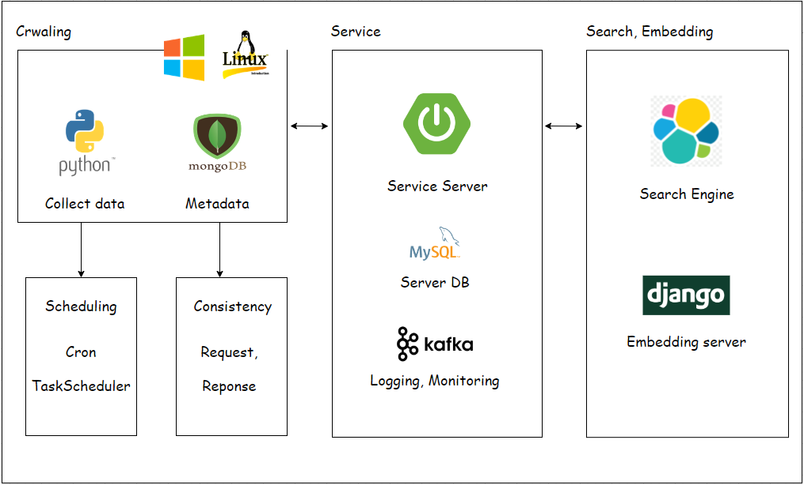
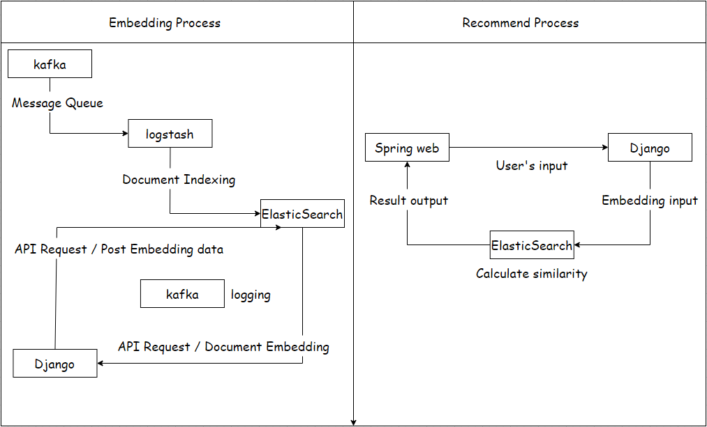
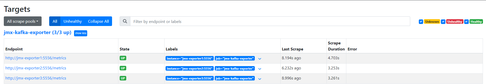
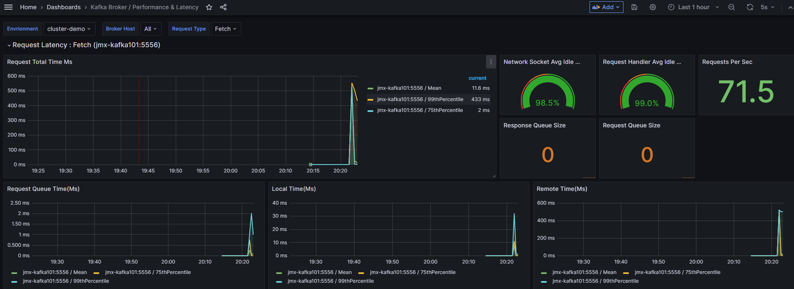
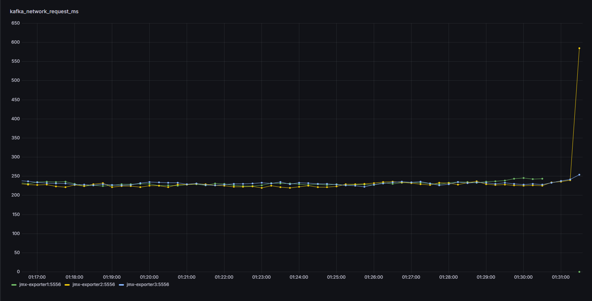
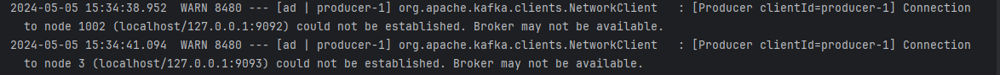
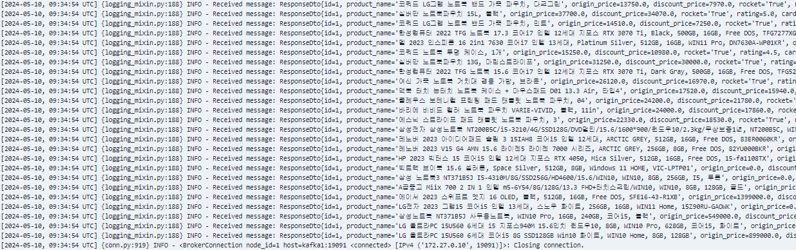
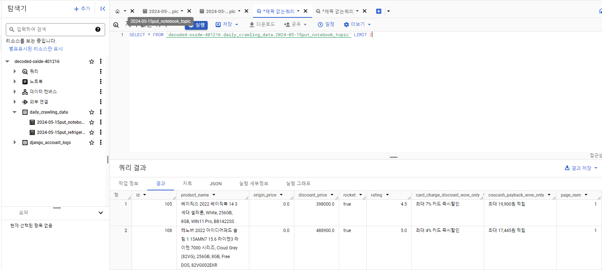

### RECOMMEND SERVICE

# item crwaling

Spring server, MySQL -> Druid(scheduled)

### __to-do list__

[x] RestAPI get, put

[x] MongoDB Meta data Schema

[x] kafka API logging(transaction) + monitoring (prometheus)

### Network load test

Shutting down a container(broker) increases the network usage of another broker.

### kafka error log

disconnect error checking

__Airflow(crawling automation)__ 

- spring server, mongodb connection refused [fail]

[x] Crontab script scheduling. (linux)

- automation crawling

- window task scheduler (window)

[x] Airflow data pipeline

- batch processing(to BigQuery)

- use commit, update next migration point

[] recommend system

Content-Based Filtering

kafka -> logstash -> es

word2vec, BERT

real time recommend

### Spring

for RestAPI

Controller, Dto, Service Logic(MVC pattern)

dirty checking, MVC, single pattern

### Python 3.9

[x] Crwaling async code (playwright) More pages, More performance

ㄴ  10% performance improvement when crawling 5 pages.

### BERT(sequence)

차원 수 768에 대한 예외 처리, 

API 작성하여 임베딩 요청하기.

### JPA 

persistence

### Break point
- gil 
- thread
- processor
- async, coroutine( .create_task .gather)

--------------------------------------------------------------

### Django embedding sever 

문장, 단어, 댓글 임배딩 서버군 완성. 

ES 인덱스에 저장된 document 활용하여 검색 기반 추천 서비스 로직 작성.
